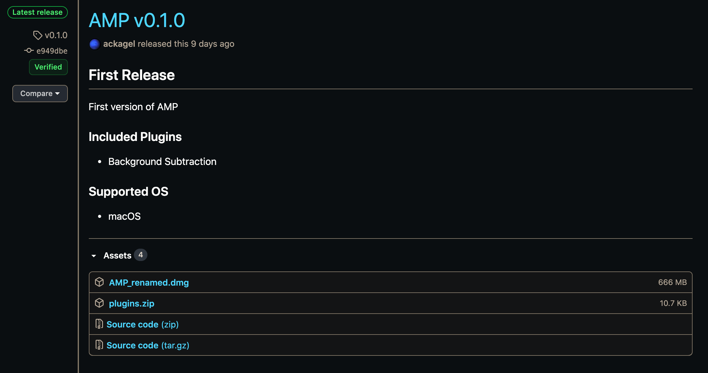
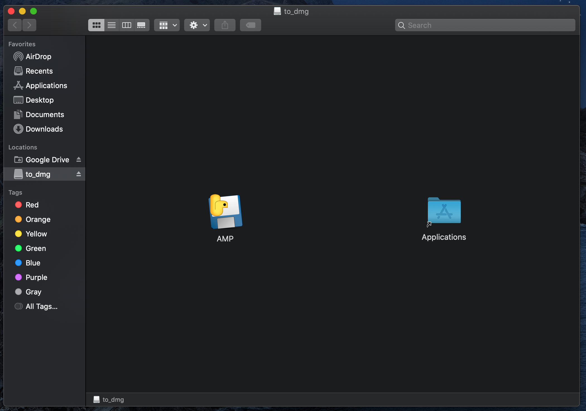
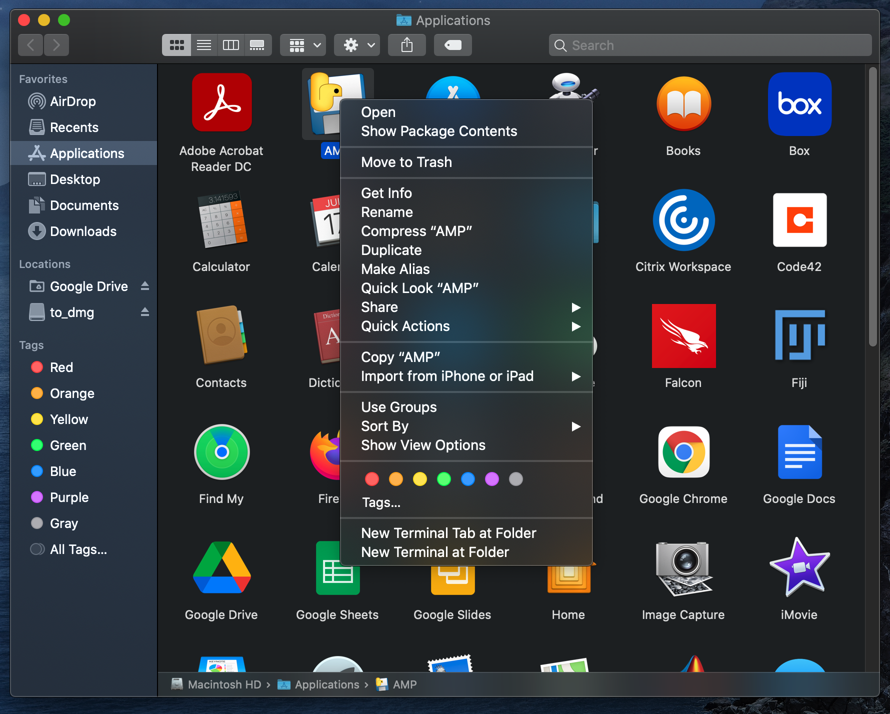
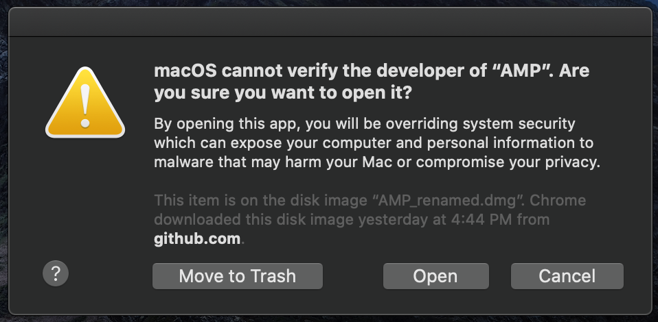

# Installation

### Download

Navigate to the [releases]() page.  Download the files `AMP_renamed.dmg` and `plugins.zip`.

### Local setup

Open `AMP_renamed.dmg` and drag the `AMP` icon into the `Applications` folder.

Open the `Applications` folder in `Finder`.  Locate `AMP`, right-click, and select the 'Open' option.

When prompted with a warning about opening the software, select the 'Open Anyways' option.  **This step is only necessary the first time the application is opened.**  For subsequent 'openings', `AMP` can be opened the same way as any other macOS application.

`AMP`'s main viewer should appear, indicating that you have sucessfully installed `AMP`!

Lastly, be sure to open/extract/unzip `plugins.zip`.  This is where the standard `AMP` plugins are
kept to be loaded in.

***

▶️ *NEXT*: [Main Viewer](./main_viewer.md)