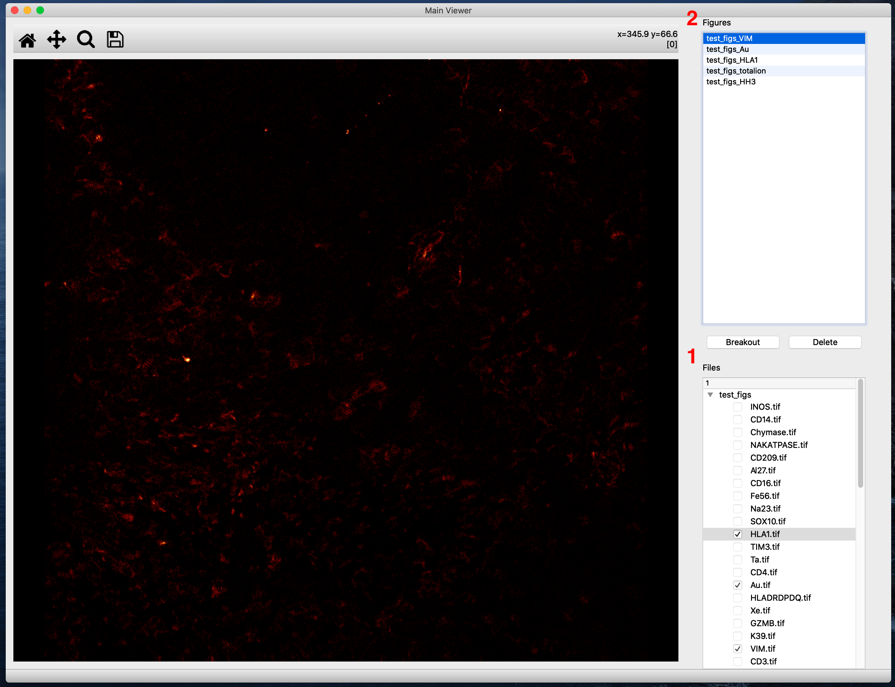

# Main Viewer


When openend, AMP will display its main image viewer.  This window will contain figures generated
by plugins as well as direct images loaded in via the 'Open Cohort' menu option.

### Cohort Loading

To load a cohort of images into the viewer, find the `Open Cohort...` option under the `File`
section of the upper taskbar.


This will open a file explorer.  Selecting and opening a folder in this explorer will have `AMP`
walk through the subdirectories within said folder until it finds the most shallow depth containing
`.tif(f)` files.  It will then load the directory structure from the selected folder, through said 
depth, into the `Files` section of the main viewer.

For example, for selecting the folder `slide01` with structure:

```
slide01
|
|------- fov1
|          |-------- TIFs
|                     |-------- Au.tif
|                     |-------- betacat.tif
|                     ...
|
|------- fov2
|          |-------- TIFs
|                     |-------- Au.tif
|                     ...
...
```

will find all of the FOV's channels.  As a counter-example, selecting the folder `bad_slide01`:

```
bad_slide01
|
|------- fov1
|          |-------- TIFs
|                     |-------- Au.tif
|                     |-------- betacat.tif
|                     ...
|
|------- fov2
|          |-------- TIFs
|                     |-------- Au.tif
|                     ...
|
|------- bad.tif
...
```

will only load in tifs at the same file depth as `bad.tif`.

<div 
    style="
        border: 0px solid #35f;
        border-left-width: 6px;
        padding: 8px;
        margin-bottom: 8px;
        background-color: #acf;
        color: #000"
> 
    <b><i>Note</i></b>:  The file explorer can only search for tifs at file depths less than 6,
    relative to the selected folder.
</div>


If the cohort was successfully loaded, you should now see a file tree within the `Files` section
(1) of the main viewer.

Clicking on displayed checkboxes will add a figure displaying that image to the `Figures` section
(2) of the viewer.



Figures within this section can be freely renamed, reordered, deleted, and unchecked.


### View Features

#### Contrast Adjustment

For dim images, contrast can be enhanced via the `Brightness and Contrast` adjustment tool within
the `Image` section of the upper taskbar.


To brighten the image, simply drag the `Max` slider towards the left.  It's recommended to enable
the `Locked` checkbox to preserve separate contrast settings for each figure.

<div 
    style="
        border: 0px solid #35f;
        border-left-width: 6px;
        padding: 8px;
        margin-bottom: 8px;
        background-color: #acf;
        color: #000"
> 
    <b><i>Note</i></b>:  Again, this tool is under active development, so exact details on
    functionality are subject to change.
</div>


#### Breakout Windows

To move a figure to a separate window, press the `Breakout` button.


Deleting this window will move the figure back into the `Figures` list within the main viewer,
where it can be deleted via the `Delete` button.

***

▶️ *NEXT*: [Plugin Loading](./plugin_loading.md)

◀️ *PREVIOUS*: [Installation](./installation.md)