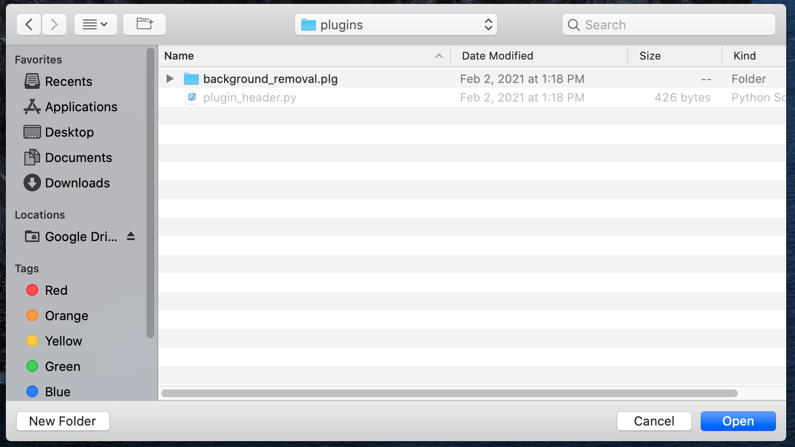
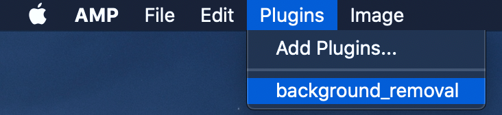

# Plugin Loading

To load in AMP plugins, select the `Add Plugins...` option from the `Plugins` section of the upper
taskbar.

Navigate to the `plugins` folder that was extracted from `plugins.zip`.  Select any of the `.plg`
folders and hit the `Open` button to load the plugin.

To open and use the plugins, open the `Plugins` section of the upper taskbar and click on the
desired plugin name.  This will open the plugin so that it can be used.

 
    <b><i>Note</i></b>:  Standard plugins are under active development.  Documentation covering
    their usage will become available as they are completed.

***

◀️ *PREVIOUS*: [Main Viewer](./main_viewer.md)